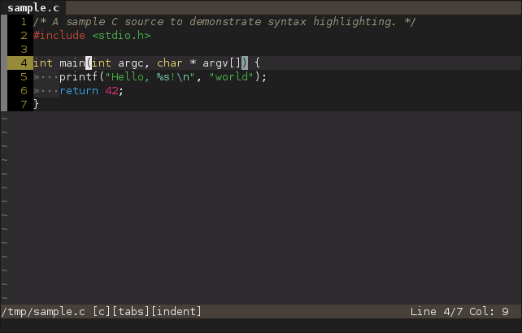
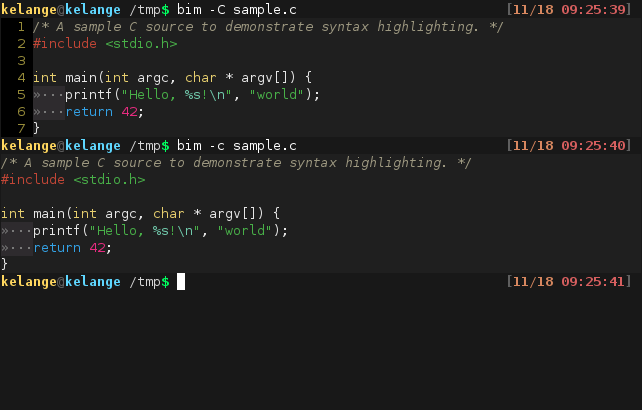
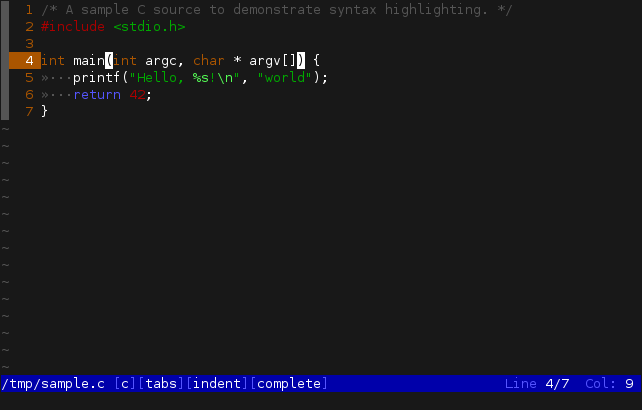
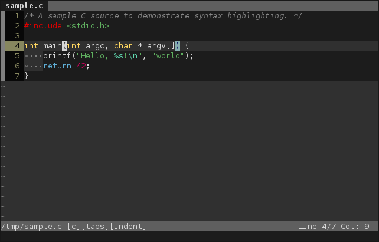
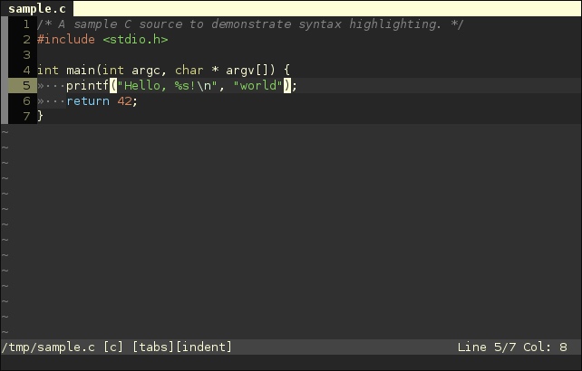
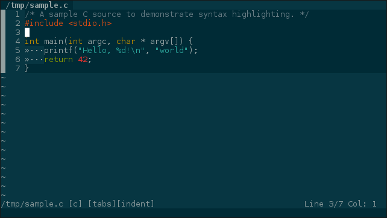

# Bim - A Bad IMitation of Vi(m)

Bim is a terminal text editor with syntax highlighting.

Inspired by Vim and featuring similar mode-based editing, Bim was originally written for ToaruOS, but it has also been tested in Linux, Sortix, FreeBSD, and macOS.

## Goals / Purpose

Bim is intended as the included text editor in ToaruOS, a hobby operating system built from scratch.

Bim aims to be lightweight and featureful with no external dependencies, providing a modern editing experience in a single fully-encapsulated binary.

## Features

- Vim-like modal interactions.
- Arrow-key and traditional vi `hjkl` navigation.
- Syntax highlighting (currently for C/C++, Python, Makefiles, Java, Rust, and a few others).
- Themes, including 256-color and 24-bit color support.
- Indentation adjustment and naïve automatic indentation.
- Multiple editor tabs.
- Basic Unicode support (sufficient for things like Japanese, but not capable of more complex scripts).
- Efficient screen redrawing.
- Terminal support tested in ToaruOS, Sortix, xterm, urxvt, Gnome, XFCE, Linux and FreeBSD consoles, macOS Terminal.app, iTerm2.
- Mouse support in Xterm-like terminals.
- Line and character selection, with yanking (paste buffer).
- Incremental forward and backward search with match highlighting and smart case sensitivity.
- Undo/redo stack.
- Highlight matching parens/braces.
- Multi-line insert mode.
- Persistent cursor location between sessions.
- Git integration, shows `git diff` status in-line, along with unsaved changes.
- Convert syntax highlighted code to an HTML document.
- (experimental) Split viewports to view multiple files or different parts of the same file.

## Prerequisites

Bim has no external dependencies beyond a functioning C library, C99 compiler, and sufficient escape code support in the hosting terminal.

### Terminal Support

Unicode support is recommended, but not completely required. Most terminals support the handful of characters used in the default setup regardless, but use `-O nounicode` if you experience issues with the rendering of tabs.

256-color and 24-bit color are optional. The default theme uses only the standard 16 colors. If your terminal only supports 8 colors, you can also supply `-O nobright` to disable bright colors.

Scrolling is normally done through `^[[1S` and `^[[1T`. If your terminal doesn't support these escapes, or has trouble scrolling, supply `-O noscroll` to have the screen refresh when scrolling. This may be slow.

Mouse support with `^[[?1000h` is available; if this escape sequence causes issues in your terminal, use `-O nomouse`.

The alternate screen is used if available with `^[[?1049h`. This can be disabled with `-O noaltscreen`.

## Key Bindings

In normal, INSERT, LINE SELECTION, CHAR SELECTION, COL SELECTION, COL INSERT, and REPLACE modes:

| **Key**    | **Action**                                      |
|------------|-------------------------------------------------|
| Arrows     | Move the cursor                                 |
| Page Up    | Scroll up one screenful                         |
| Page Down  | Scroll down one screenful                       |
| Home       | Move cursor to start of line                    |
| End        | Move cursor to end of line (past end in INSERT) |
| Ctrl-Left  | Move to start of previous word                  |
| Ctrl-Right | Move to start of next word                      |
| Escape     | Return to normal mode                           |

When in normal mode:

| **Key**     | **Action**                                                                              |
|-------------|-----------------------------------------------------------------------------------------|
| `:`         | Start entering a command                                                                |
| `/`         | Start incremental search                                                                |
| `?`         | Start backwards incremental search                                                      |
| `n`         | Find next search match                                                                  |
| `N`         | Find previous search match                                                              |
| `v`         | Enter CHAR SELECTION mode                                                               |
| `V`         | Enter LINE SELECTION mode                                                               |
| Ctrl-`V`    | Enter COL SELECTION mode                                                                |
| `R`         | Enter REPLACE mode                                                                      |
| `i`         | Enter INSERT mode                                                                       |
| `a`         | Enter INSERT mode with the cursor after the current position (for appending characters) |
| `O`         | Add line before current line, and enter INSERT mode.                                    |
| `o`         | Add line after current line, and enter INSERT mode.                                     |
| `hjkl`      | Vi-style navigation                                                                     |
| Space       | Scroll down one screen                                                                  |
| `%`         | Jump to the matching brace/parenthesis                                                  |
| `{`         | Jump to previous blank line                                                             |
| `}`         | Jump to next blank line                                                                 |
| `$`         | Move the cursor to the end of the line                                                  |
| `^` or `0`  | Move the cursor to the beginning of the line                                            |
| `Pp`        | Paste yanked lines, before or after (respectively)                                      |
| `u`         | Undo last block of edits                                                                |
| Ctrl-`R`    | Redo last undone block of edits                                                         |
| Ctrl-`L`    | Repaint the screen                                                                      |

In LINE SELECTION and CHAR SELECTION modes the following additional commands are available:

| **Key**     | **Action**                                               |
|-------------|----------------------------------------------------------|
| `d`         | Delete and yank selected text                            |
| `y`         | Yank selected text                                       |

In LINE SELECTION mode, indentation can be adjusted over multiple lines:

| **Key**     | **Action**                                               |
|-------------|----------------------------------------------------------|
| Tab         | Indent selected lines one indentation unit to the right  |
| Shift-Tab   | Unindent selected lines one indentation unit to the left |

In INSERT mode, the following additional commands are available:

| **Key**     | **Action**               |
|-------------|--------------------------|
| `^V`        | Insert literal character |
| `^W`        | Delete previous word     |

In COL SELECTION mode, you can enter COL INSERT mode to insert characters on multiple lines simultaneously:

| **Key**    | **Action**                |
|------------|---------------------------|
| `I`        | Enter COL INSERT mode     |

## Commands

| **Command**        | **Description**                                                                                |
|--------------------|------------------------------------------------------------------------------------------------|
| `:e FILE`          | Open `FILE` in a new tab (for some compatibility with vim)                                     |
| `:tabnew FILE`     | Open `FILE` in a new tab                                                                       |
| `:tabnew`          | Create a new empty tab                                                                         |
| `:w`               | Write the current file                                                                         |
| `:w FILE`          | Write the current buffer to `FILE`                                                             |
| `:wq`              | Write the current file and close this buffer                                                   |
| `:q`               | Close this buffer if it has not been modified                                                  |
| `:q!`              | Close this buffer even if it has been modified                                                 |
| `:qa`              | Try to close all buffers                                                                       |
| `:qa!`             | Quit immediately, ignoring unsaved changes                                                     |
| `:tabp`            | Switch to previous tab                                                                         |
| `:tabn`            | Switch to next tab                                                                             |
| `:indent`          | Enable automatic indentation                                                                   |
| `:noindent`        | Disable automatic indentation                                                                  |
| `:noh`             | Clear search string                                                                            |
| `:theme`           | Print the current selected color scheme                                                        |
| `:theme THEME`     | Set the color scheme to `THEME` (use tab completion to see available themes)                   |
| `:syntax`          | Print the current syntax highlighting mode (also displayed in the status bar)                  |
| `:syntax LANGUAGE` | Set the syntax highlighting mode to `LANGUAGE` (use tab completion to see available languages) |
| `:recalc`          | Recalculate syntax highlighting for the whole buffer                                           |
| `:tabs`            | Set the tab key and automatic indentation to insert tab characters                             |
| `:spaces`          | Set the tab key and automatic indentation to insert spaces                                     |
| `:tabstop`         | Print the current tab stop (how wide one indentation unit is)                                  |
| `:tabstop TABSTOP` | Set the tab stop width                                                                         |
| `:clearyank`       | Clear the yank buffer                                                                          |
| `:padding`         | Print the current cursor vertical padding (space between cursor and screen edge)               |
| `:padding PADDING` | Set the cursor vertical padding                                                                |
| `:hlparen`         | Print the status of the matching paren/brace highlighting setting                              |
| `:hlparen VALUE`   | Enable (1) or disable (0) highlighting of matching parenthesis and braces                      |
| `:hlcurrent`       | Print the status of the highlight-current-line setting                                         |
| `:hlcurrent VALUE` | Enable (1) or disable (0) highlight of the current line                                        |
| `:smartcase`       | Print the status of the smartcase setting                                                      |
| `:smartcase VALUE` | Enable (1) or disable (0) smart case sensitivty when searching                                 |
| `:split`           | Split either the current buffer or the first two tabs into a vertical viewing mode             |
| `:split file`      | Open a new file next to the current buffer                                                     |
| `:s P`             | Replace text, `P` is a sed pattern (eg. `/foo/bar/g`); supports `g`, `i` options; no regex yet |
| `:git VALUE`       | Enable (1) or disable (0) `git diff` integration.                                              |
| `:tohtml`          | Created an HTML document with syntax highlighted text from the currently open document         |

## Additional Bim Functionality

You can use Bim to display files in your terminal with syntax highlighting with `bim -c` (no line numbers) and `bim -C` (with line numbers).

You can pipe text to bim for editing with `bim -`. Note that Bim will wait for end-of-file before launching, so this is not suitable for use as a pager (pager support is planned).

## Themes

Bim includes a handful of color schemes for the interface and syntax highlighting.

### ANSI

The default 16-color theme. Can be configured for use on terminals with or without bright color support. Looks a bit like Irssi.

### Sunsmoke

An original 24-bit color theme with rustic browns and subdued pastel colors.

### Sunsmoke-256

A 256-color version of Sunsmoke for use in terminals that do not support 24-bit color.

### Wombat

A 256-color theme based on the theme of the same name for Vim.

### Solarized Dark

A 24-bit color theme based on the popular color palette.

### City Lights

A 24-bit color theme based on the one for Atom and Sublime, featuring low contrast blues.

## Config File

You can set the default theme in `~/.bimrc`:

    # set a color theme, sunsmoke is a 24-bit theme
    theme=sunsmoke
    # set a scroll offset so the cursor isn't at the bottom or top of the screen
    padding=4

## Syntax Support

Not all syntax highlighters are complete or support all features of their respective languages.

- C/C++
- Python
- Java
- diffs
- Generic INI-style config files
- Rust
- git commits and interactive rebase
- Make / GNU Make
- Markdown (with some inline code highlighting support)
- JSON
- XML / HTML
- Protobuf
- Bash

## Why is Bim a single ~10k line source file?

Bim was designed to be the included text editor in ToaruOS, and ToaruOS's build system was designed to have a single source file for each application binary.
For the vast majority of applications in ToaruOS, this limitation is entirely reasonable.
Bim is by far the largest application in the OS; the window compositor comes in second at a much smaller ~3000 lines.
As Bim has grown, the question has come up several times as to whether it should be broken up into logical units in separate files, but being a single large file still has its benefits.

## License

Bim is released under the terms of the ISC license, which is a simple BSD-style license. See [LICENSE](LICENSE) for details.

## Development

Bim is still primarily developed alongside ToaruOS. This repository is a mirror with fake history going back to the start of that project. Pull requests merged here will be patched into [ToaruOS](https://git.toaruos.org/klange/toaruos).

## Community

If you're using Bim, want to contribute to development, or have ideas for new features, join us in `#bim` on Freenode.
