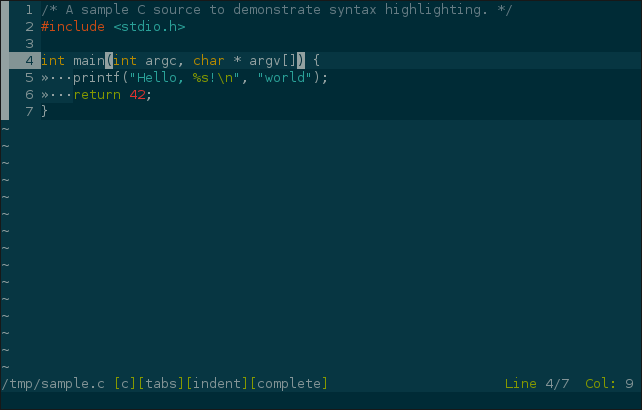
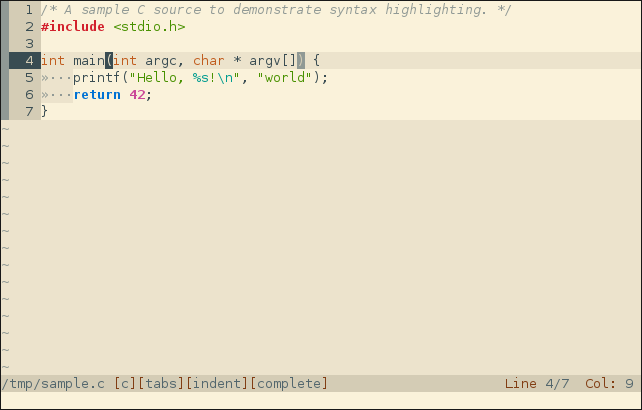

# Bim - A Text Editor

Bim is a terminal text editor with syntax highlighting.

Inspired by Vim (one might say a Bad Imitation) and featuring similar mode-based editing, Bim was originally written for ToaruOS, but it has also been tested in Linux, Sortix, FreeBSD, and macOS.

## Goals / Purpose

Bim is intended as the included text editor in ToaruOS, a hobby operating system built from scratch.

Bim aims to be lightweight and featureful with no external dependencies, providing a modern editing experience in a lightweight, extensible package.

## Features

- Vim-like modal interactions.
- Arrow-key and traditional vi `hjkl` navigation.
- Syntax highlighting (currently for C/C++, Python, Makefiles, Java, Rust, and a few others).
- Integrated scripting environment with [Kuroko](https://github.com/kuroko-lang/kuroko).
- Themes, including 256-color and 24-bit color support.
- Indentation adjustment and naïve automatic indentation.
- Multiple editor tabs.
- Basic Unicode support (sufficient for things like Japanese, but not capable of more complex scripts).
- Efficient screen redrawing.
- Terminal support tested in ToaruOS, Sortix, xterm, urxvt, Gnome, XFCE, Linux and FreeBSD consoles, macOS Terminal.app, iTerm2.
- Mouse support in Xterm-like terminals.
- Line and character selection, with yanking (paste buffer).
- Incremental forward and backward search with match highlighting and smart case sensitivity.
- Undo/redo stack.
- Highlight matching parens/braces.
- Multi-line insert mode.
- Persistent cursor location between sessions.
- Git integration, shows `git diff` status in-line, along with unsaved changes.
- Convert syntax highlighted code to an HTML document.
- Split viewports to view multiple files or different parts of the same file.
- Simple autocompletions using ctags.

## Build Requirements

Bim requires only a sufficiently Unix-like C library and a C99 compiler with certain GNU extensions (such as `__attribute__((constructor))`).

Bim has been built successfully for a number of targets, including various BSDs, ToaruOS, Sortix, and others.

### Terminal Support

Bim has been tested in a number of terminals, and while it does not use `terminfo` databases, basic functionality should be available in the vast majority of remnant emulators and even classic DEC hardware.

If the terminal you are using has some quirks or does not play well with the default assumptions, you can modify the behavior to suit your environment.

Capability features can be controlled with "quirks", either through the `quirk` command in a bimrc, or with the `-O` command line option.

The format of the `quirk` command is `quirk(envvar,teststr,'no...','can...',...)` where `ENVVAR` is the name of an environment variable and `teststr` is a string to check against which must be a prefix of the environment variable.

For example, `quirk('TERM','xterm','nounicode')` will disable Unicode output on all terminals starting with "xterm" (including "xterm-256color").

You may also specifies quirks with the `$COLORTERM` environment variable, or the `$TERMINAL_EMULATOR` variable set by certain IDEs.

Some example quirk configurations are provided in [docs/example.bim3rc](docs/example.bim3rc) and may be a good place to start if you are experiencing rendering issues.

Unicode/UTF-8 support is recommended and assumed by default. The `nounicode` quirk option will disable output of UTF-8 characters and render them as codepoint hints like `<U+1234>` instead.

256-color and 24-bit color are also assumed by default, disable them with the `no256color` and `no24bit` quirks respectively.

If you have a particularly low-color terminal, the `nobright` quirk will hint to themes that only the lower 8 colors should be used.

Three scroll modes are supported: shift scrolling, insert/delete scrolling, and redraw scrolling.

Shift scrolling (`^[[1S`/`^[[1T`) is assumed by default. If your terminal supports insert/delete scrolling (`^[[L`/`^[[M`), enable the `caninsert` quirk.

If neither scrolling option is available, use the `noscroll` quirk to redraw the text field when scrolling. This will probably be slow!

Mouse support with `^[[?1000h` is assumed by default. Use the `nomouse` quirk to disable it.

If your terminal supports SGR mouse modes ("1006"), enable the `cansgrmouse` quirk. Most xterm-like terminals support this and it will provide support for click on cells in larger terminal windows.

Alternate screen support is also assumed. This is normally fine even if your terminal doesn't support it, but if it causes issues the `noaltscreen` quirk will disable it.

## Key Bindings

Default keybindings can be found in [docs/mappings.md](docs/mappings.md).

This listing can be generated with `bim --dump-mappings`.

## Commands

A complete listing of available commands can be found in [docs/commands.md](docs/commands.md).

This listing can be generated with `bim --dump-commands`.

## Additional Bim Functionality

You can use Bim to display files in your terminal with syntax highlighting with `bim -c` (no line numbers) and `bim -C` (with line numbers).

You can pipe text to bim for editing with `bim -`. Note that Bim will wait for end-of-file before launching, so this is not suitable for use as a pager (pager support is planned).

Bim can also be used to generate HTML documents with syntax-highlighted source code with `bim --html`; the configured theme will be used.

## Themes

Bim includes a handful of color schemes for the interface and syntax highlighting.

### ANSI

A plain 16-color theme. Can be configured for use on terminals with or without bright color support. Looks a bit like Irssi.

### Sunsmoke

An original 24-bit color theme with rustic browns and subdued pastel colors.

### Sunsmoke-256

A 256-color version of Sunsmoke for use in terminals that do not support 24-bit color.

### Wombat

A 256-color theme based on the theme of the same name for Vim.

### Solarized Dark

A 24-bit color theme based on the popular color palette.

### City Lights

A 24-bit color theme based on the one for Atom and Sublime, featuring low contrast blues.

### Light

Based on selenized by Jan Warchoł

## Config File

Bim will automatically run commands from `~/.bim3rc` on startup.

A detailed bimrc example is available at [docs/example.bim3rc](docs/example.bim3rc).

Bim scripts are written in [Kuroko](https://github.com/kuroko-lang/kuroko).

## Syntax Support

Not all syntax highlighters are complete or support all features of their respective languages.

- C/C++
- Python
- Java
- diffs
- Generic INI-style config files
- Rust
- git commits and interactive rebase
- Make / GNU Make
- Markdown (with some inline code highlighting support)
- JSON
- XML / HTML
- Protobuf
- Bash

## Code Structure

Bim's core functionality lives in `bim.c`.

Syntax highlighters and themes are written in Kuroko and found in the `syntax` and `themes` directories.

## Bim is not Vim

Some interactions in Bim work differently from Vim, and sometimes this is intentional.
Bim's primary interactions are built around a selection, while Vim has verbs and navigation nouns.
`CHAR SELECTION` does not let the cursor move past the end of the line, unlike `VISUAL` mode in Vim.

## Bim wants to be more like Vim

Some interactions in Bim work differently from Vim, and sometimes this is unintentional.
Bim is missing many features I would like to implement, like regular expression search (and replacement).

## License

Bim is released under the terms of the ISC license, which is a simple BSD-style license. See [LICENSE](LICENSE) for details.

## Development

Bim is still primarily developed alongside ToaruOS. This repository is a mirror with fake history going back to the start of that project. Pull requests merged here will be patched into [ToaruOS](https://git.toaruos.org/klange/toaruos).

## Community

If you're using Bim, want to contribute to development, or have ideas for new features, join us in `#bim` on Freenode.
